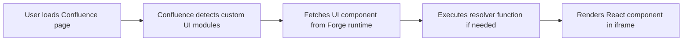

# Core Concepts: Forge for Confluence Cloud

This guide covers the fundamental concepts needed to build apps on Atlassian's Forge platform specifically for Confluence Cloud.

---

## What is Forge?

Forge is Atlassian's serverless development platform for building apps and integrations for Atlassian cloud products (Jira, Confluence, Trello). Unlike the old Connect framework, Forge:

- **Serverless**: No infrastructure to manage - Atlassian handles everything
- **Managed runtime**: Your code runs in a secure, isolated environment
- **Built-in authentication**: OAuth handled automatically via manifest permissions
- **Rate-limited APIs**: Built-in rate limiting protection
- **Modern tooling**: CLI-based development with `forge` commands

---

## Confluence Forge Architecture

```
┌─────────────────────────────────────────────────────────────┐
│                    Confluence UI                            │
│  ┌─────────────┐  ┌──────────────┐  ┌──────────────────┐   │
│  │ Page Content│  │ Custom UI    │  │ Space Settings   │   │
│  │             │◄─┤ Extension    │  │ Panel            │   │
│  └─────────────┘  └──────────────┘  └──────────────────┘   │
└─────────────────────────────────────────────────────────────┘
                              │
                              ▼
┌─────────────────────────────────────────────────────────────┐
│                   Forge Runtime                             │
│  ┌───────────────────────────────────────────────────────┐  │
│  │  Serverless Functions (your code)                     │  │
│  │  - Custom UI resolvers                                │  │
│  │  - Webhook handlers                                   │  │
│  │  - Scheduled triggers                                 │  │
│  └───────────────────────────────────────────────────────┘  │
└─────────────────────────────────────────────────────────────┘
                              │
                              ▼
┌─────────────────────────────────────────────────────────────┐
│              Confluence REST API v2                         │
│  https://{domain}.atlassian.net/wiki/api/v2                │
└─────────────────────────────────────────────────────────────┘
```

---

## Key Components

### 1. Manifest (`manifest.yml`)

The manifest defines your app's configuration:

```yaml
app:
  id: ari:cloud:ecosystem::app/your-app-id
  name: My Confluence App
  description: An app that adds custom UI to Confluence pages

permissions:
  scopes:
    - read:confluence-content:*
    - write:confluence-content:*

modules:
  confluence:pageCustomUi:
    - key: my-extension
      resource: main
      title: My Extension
  
  resource:
    - key: main
      path: src/page-custom-ui.jsx
```

### 2. Modules

Modules are the building blocks of your app:

| Module Type | Description |
|-------------|-------------|
| `confluence:pageCustomUi` | Custom UI on Confluence pages |
| `confluence:blogPostCustomUi` | Custom UI on blog posts |
| `confluence:spaceSettings` | Configuration panel in space settings |
| `webhook` | Handle Confluence events |
| `function.scheduled` | Background scheduled tasks |
| `customContent` | Create custom content types (v2) |

### 3. Resources

Resources are the files that make up your app:
- **Custom UI**: React components (JSX/TSX)
- **Functions**: Serverless functions for API calls
- **Static assets**: Icons, images referenced in manifest

---

## Custom UI Lifecycle



### The Resolver Pattern

For dynamic content, you'll need a resolver:

1. **Custom UI** calls `AP.context.getToken()` to get auth token
2. Your app makes API call with that token
3. Data is fetched from Confluence REST API v2
4. Component renders the data

```jsx
import React, { useEffect, useState } from 'react';
import { api } from '@forge/bridge';

export default function PageExtension() {
  const [data, setData] = useState(null);

  useEffect(() => {
    async function fetchData() {
      const token = await AP.context.getToken(); // Get auth token
      
      const response = await api.fetch({
        url: '/wiki/api/v2/pages/by-title',
        headers: { Authorization: `Bearer ${token}` }
      });
      
      setData(await response.json());
    }
    
    fetchData();
  }, []);

  return <div>{/* Your UI here */}</div>;
}
```

---

## Content Types in Confluence Forge

### Page (`page`)
The most common content type. Custom UI can be added to any page.

### Blog Post (`blogpost`)
Blog posts also support custom UI, though less commonly used than pages.

### Space (`space`)
Space-level configuration via `confluence:spaceSettings` module.

### Whiteboard (`whiteboard`)
Newer content type for collaborative whiteboards (limited API support).

---

## REST API v2 Overview

The Confluence REST API v2 is the current standard:

```
Base URL: https://{domain}.atlassian.net/wiki/api/v2
```

**Key endpoints:**

| Endpoint | Description |
|----------|-------------|
| `/pages` | Get/create pages |
| `/pages/{id}` | Get/update/delete specific page |
| `/blogposts` | Get/create blog posts |
| `/spaces` | List spaces |
| `/search` | Search content |

**Authentication:**
- OAuth 2.0 (3LO) for external apps
- JWT token from Forge for internal calls
- Token exchange via `@forge/bridge/api`

---

## Permissions & Scopes

Confluence Forge apps require specific scopes:

```yaml
permissions:
  scoped:
    - spaces:178263459270
    - sites:https://mycompany.atlassian.net
  scopes:
    - read:confluence-content:*     # Read pages, blogposts
    - write:confluence-content:*    # Create/update content
    - admin:confluence-space:*      # Space administration
```

---

## Event Types for Webhooks

| Event | Description | Trigger |
|-------|-------------|---------|
| `confluence:page:created` | New page created | Immediately after creation |
| `confluence:page:updated` | Page content changed | On save/update |
| `confluence:page:deleted` | Page moved to trash | When deleted/moved |
| `confluence:blogpost:created` | New blog post | After publication |
| `confluence:space:created` | New space created | Space creation |

---

## Development Workflow

```bash
# 1. Install Forge CLI
npm install -g @forge/cli

# 2. Login to Atlassian account
forge login

# 3. Create new project
forge create

# 4. Deploy your app
forge deploy --verbose

# 5. Register the app in Confluence
forge register

# 6. Local development (with tunnel)
forge tunnel
```

---

## Next Steps

- [Page Custom UI](02-page-custom-ui.md) - Build page extensions
- [Webhooks & Events](07-webhooks-events.md) - Handle Confluence events  
- [REST API Reference](08-api-endpoints.md) - Complete API guide